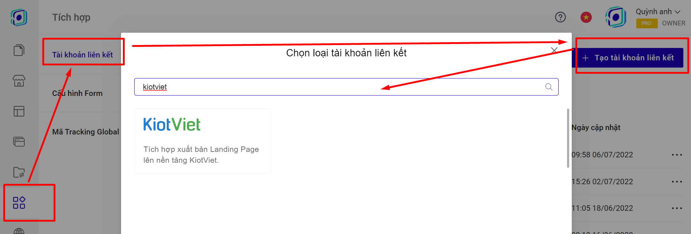

# 8. Đồng bộ đơn hàng từ Landing Page sang KiotViet

Để đồng bộ đơn hàng từ LadiPage lên KiotViet, trước tiên bạn cần phải có tài khoản tại **KiotViet** và tạo các sản phẩm ở mục Hàng Hóa-Danh Mục của KiotViet.

Sau đó bạn có thể thực hiện theo các bước sau đây:

**Bước 1: Tạo tài khoản liên kết.**

Truy cập trang [builder.ladipage.com](http://builder.ladipage.com/), chọn menu **Tích hợp -> Tài khoản liên kết -> Tạo tài khoản liên kết.** Sau đó lựa chọn Loại tài khoản là KiotViet.

<figure><figcaption></figcaption></figure>

**Bước 2:** Nhập đầy đủ các thông tin:

**Tên Liên kết:** là tên để phân biệt với các liên kết khác.&#x20;

**Clinet ID, Mã bảo mật**: lấy từ tài khoản KiotViet của bạn.

.png>)

Cách lấy các thông số kết nối trong KiotViet.

.png>)


**Lưu ý: phần TÊN KẾT NỐI phải Trùng với phần tên trong link đăng nhập kiotviet của bạn, ví dụ như trong hướng dẫn, tên kết nối là check1111, giống với tên trong đường dẫn đăng nhập tài khoản.**&#x20;


#### .png>)

#### Bước 3: **Tạo** cấu hình lưu trữ form.

Vào lại trang builder.ladipage.com, chọn menu **Tích hợp -> Cấu hình Form -> Tạo cấu hình form.**

<figure><figcaption></figcaption></figure>

Bấm nút **Chọn** để sử dụng tài khoản liên kết bạn muốn dùn&#x67;**.**

.png>)

Nhập **Tên cấu hình** để lưu lại cấu hình form vừa tạo và bấm nút **Hoàn tất.**&#x20;

.png>)

Bạn có thể chọn **thêm tài khoản liên kết** khác cho Cấu hình này. Mỗi cấu hình được chứa tối đa 3 tài khoản liên kết, tương đương với 3 nguồn lưu trữ thông tin khách hàng đồng thời nhận được từ form đăng ký trên Landing Page.

**Bước 4:** Quay trở lại form trên trang Landing Page, chọn toàn form bạn đang muốn cài đặt và chọn **"Lưu data":**

.png>)

**Bước 5 :** Sau khi chọn cấu hình form, bạn cần phải vào form dăng ký của bạn, chọn SẢN PHẨM trên KiotViet sẽ hiển thị trên form của bạn theo [chi tiết hướng dẫn tại đây](https://help.ladipage.vn/dong-bo-don-hang-sang-cac-nen-tang-website-thuong-mai-dien-tu-va-phan-mem-quan-ly-ban-hang/tao-form-dang-ky-lien-ket-voi-cac-website-thuong-mai-dien-tu-phan-mem-quan-ly-ban-hang).


**`Lưu ý:`**

`Bạn muốn chọn sản phẩm từ KiotViet để hiển thị trên form của LadiPage,thì KHÔNG tìm kiếm theo tên sản phẩm mà tìm kiếm bằng`**`MÃ HÀNG`**`ở bên KiotViet.`


.png>)

Vậy là bạn đã hoàn thành việc đồng bộ đơn hàng từ Landing Page sang mục **Giao dịch, đặt hàng của KiotViet.**

.png>)

.png>)

.png>)


**Lưu ý:** Ở KiotViet, nếu bạn không cho phép đặt hàng khi hết hàng, thì đơn hàng sẽ không về phần quản lý của KiotViet khi khách hàng đặt hàng quá số lượng tồn kho của sản phẩm đó. Thông tin cài đặt này bạn có thể kiểm tra ở mục như ảnh hướng dẫn (Thiết lập, Giao dịch, Đặt hàng).


.png>)
