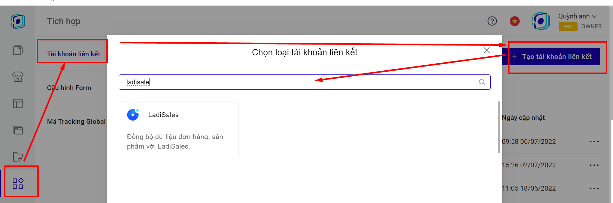

# 4. Đồng bộ đơn hàng từ Landing Page sang LadiSales

**Bước 1: Tạo tài khoản liên kết.**

Truy cập trang [builder.ladipage.com](http://builder.ladipage.com/), chọn menu **Tích hợp -> Tài khoản liên kết -> Tạo tài khoản liên kết.** Sau đó lựa chọn Loại tài khoản là **LadiSales.**

<figure><figcaption></figcaption></figure>

**Bước 2:** Nhập đầy đủ các thông tin:

.png>)

**Tên Liên kết:** là tên để phân biệt với các liên kết khác.&#x20;

**API KEY**: lấy từ tài khoản Ladisales của bạ&#x6E;**.**

Cách lấy API KEY trong tài khoản LadiSales.

.png>)

#### Bước 3: **Tạo** cấu hình lưu trữ form&#x20;

Vào lại trang builder.ladipage.com, chọn menu **Tích hợp -> Cấu hình Form -> Tạo cấu hình form.**

<figure><figcaption></figcaption></figure>

Bấm nút **Chọn** để sử dụng tài khoản liên kết **Ladisales** bạn muốn dùng.

.png>)

Nhập **Tên cấu hình** để lưu lại cấu hình form vừa tạo và bấm nút **Hoàn tất.**

.png>)

Bạn có thể chọn **thêm tài khoản liên kết** khác cho Cấu hình này. Mỗi cấu hình được chứa tối đa 3 tài khoản liên kết, tương đương với 3 nguồn lưu trữ thông tin khách hàng đồng thời nhận được từ form đăng ký trên Landing Page.

**Bước 4:** Quay trở lại form trên trang Landing Page, chọn toàn form bạn đang muốn cài đặt và chọn **"Lưu data":**

.png>)

**Bước 5 :** Sau khi chọn cấu hình form, bạn cần phải vào form dăng ký của bạn, chọn SẢN PHẨM trong **LadiSales** sẽ hiển thị trên form của bạn theo [chi tiết hướng dẫn tại đây](https://help.ladipage.vn/dong-bo-don-hang-sang-cac-nen-tang-website-thuong-mai-dien-tu-va-phan-mem-quan-ly-ban-hang/tao-form-dang-ky-lien-ket-voi-cac-website-thuong-mai-dien-tu-phan-mem-quan-ly-ban-hang).

Vậy là bạn đã hoàn thành việc đồng bộ đơn hàng từ Landing Page sang  mục **Đơn hàng của LadiSales.**

.png>)
