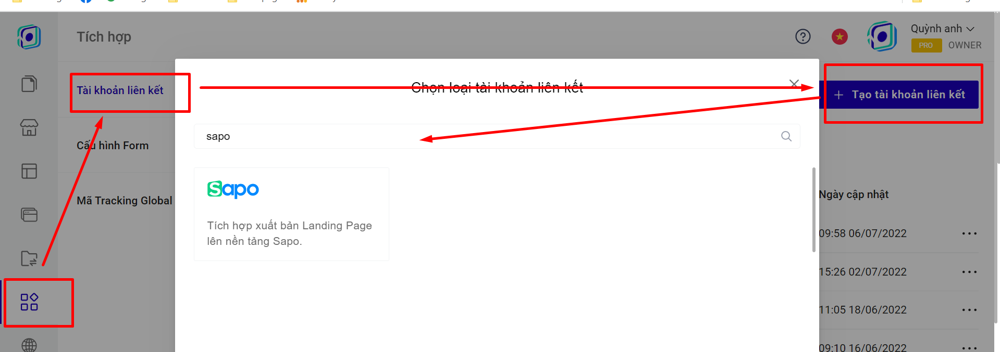
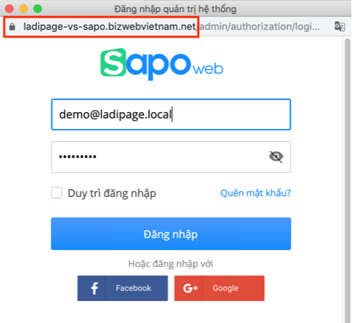

# 9. Đồng bộ đơn hàng từ Landing Page sang Sapo

Để đồng bộ đơn hàng từ LadiPage lên nền tảng Sapo, trước tiên bạn cần phải có tài khoản tại Sapo và tạo các sản phẩm ở mục Sản phẩm của Sapo.

Sau đó bạn có thể thực hiện theo các bước sau đây:

**Bước 1: Tạo tài khoản liên kết.**

Truy cập trang [builder.ladipage.com](http://builder.ladipage.com/), chọn menu **Tích hợp -> Tài khoản liên kết -> Tạo tài khoản liên kết.** Sau đó lựa chọn Loại tài khoản là **Sapo.**

<figure><figcaption></figcaption></figure>

**Bước 2:** Nhập đầy đủ các thông tin:

**Tên Liên kết:** Là tên để phân biệt với các liên kết khác.&#x20;

**API URL**: Lấy từ tài khoản admin Sapo của bạn.

.png>)

<figure><figcaption></figcaption></figure>

#### Bước 3: **Tạo** cấu hình lưu trữ for&#x6D;**.**&#x20;

Vào lại trang builder.ladipage.com, chọn menu **Tích hợp -> Cấu hình Form -> Tạo cấu hình form.**

<figure><figcaption></figcaption></figure>

Bấm nút **Chọn** để sử dụng tài khoản liên Sapo kết bạn muốn dùng.&#x20;

.png>)

Nhập **Tên cấu hình** để lưu lại cấu hình form vừa tạo và bấm nút **Hoàn tất.**

.png>)

Bạn có thể chọn **thêm tài khoản liên kết** khác cho Cấu hình này. Mỗi cấu hình được chứa tối đa 3 tài khoản liên kết, tương đương với 3 nguồn lưu trữ thông tin khách hàng đồng thời nhận được từ form đăng ký trên Landing Page.

**Bước 4:** Quay trở lại form trên trang Landing Page, chọn toàn form bạn đang muốn cài đặt và chọn **"Lưu data":**

.png>)

**Bước 5:** Sau khi chọn cấu hình form, bạn cần phải vào form dăng ký của bạn, chọn SẢN PHẨM trên Sapo sẽ hiển thị trên form của bạn theo [chi tiết hướng dẫn tại đây](https://help.ladipage.vn/dong-bo-don-hang-sang-cac-nen-tang-website-thuong-mai-dien-tu-va-phan-mem-quan-ly-ban-hang/tao-form-dang-ky-lien-ket-voi-cac-website-thuong-mai-dien-tu-phan-mem-quan-ly-ban-hang).

Vậy là bạn đã hoàn thành việc gửi đơn hàng từ Landing Page sang **mục Đơn hàng trên Sapo.**

.png>)

.png>)
