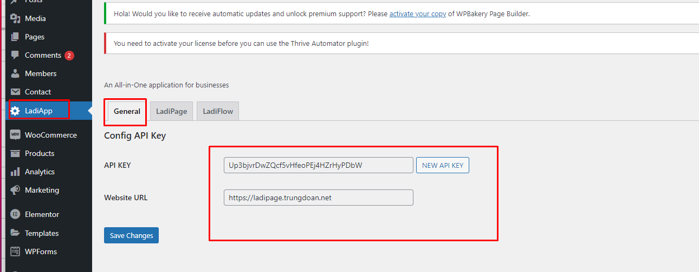
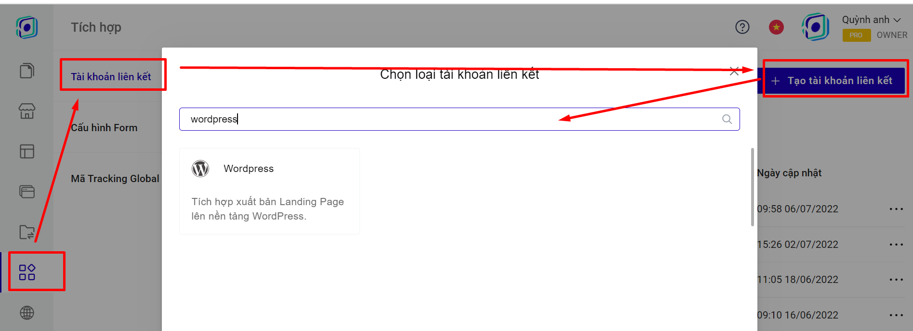

# 6. Đồng bộ đơn hàng từ Landing Page sang Wordpress

Để đồng bộ đơn hàng từ LadiPage lên nền tảng Wordpress, trước tiên bạn cần phải có tài khoản tại WordPress, tạo các sản phẩm ở plugin Woocommerce của Wordpress và cài đặt plugin LadiPage trong Wordpress.

**Bước 1: Cài đặt Plugin LadiPage trong Wordpress.**

Bước 1: Đăng nhập trang quản trị website WordPress của bạn với **quyền Admin.**

Bước 2: Tại menu **Plugins** chọn **Add New Plugin** để cài đặt plugins mới.

Bước 3: Chọn Tệp file plugin LadiPage để cài đặt plugin vào Wordpress


Tải tệp cài đặt ứng dụng plugin LadiPage [tại đấy](https://drive.google.com/file/d/1nu-atpCcIfyEFx4T5bAK-nCb9cKwr6dr/view)





Trong trường hợp tải file.ladipage báo lỗi, vui lòng kiểm tra lại thông tin hosting, xem cấp quyền tải file không.&#x20;


Bước 4: Chọn mục LadiApp tại menu bên trái của trang quản trị, sau đó sao chép lại nội dung trong 2 ô **API KEY** và **API URL (Lưu ý: bấm Save Changes sau khi lấy API).**

<figure><figcaption></figcaption></figure>

**Bước 2: Tạo tài khoản liên kết.**

Truy cập trang [builder.ladipage.com](http://builder.ladipage.com/), chọn menu **Tích hợp -> Tài khoản liên kết -> Tạo tài khoản liên kết.** Sau đó lựa chọn Loại tài khoản là **Wordpress**

<figure><figcaption></figcaption></figure>

**Bước 3:** Nhập đầy đủ các thông tin:

**Tên Liên kết:** là tên để phân biệt với các liên kết khác.&#x20;

**API URL và API Key:** 2 thông số lấy trong Plugin **Ladi Page** bạn đã cài đặt trong Wordpress theo hướng dẫn ở bước &#x31;**.**

Ấn **Thêm tài khoản** để Lưu.

.png>)

#### Bước 3: **Tạo** cấu hình lưu trữ form.

Vào lại trang builder.ladipage.com, chọn menu **Tích hợp -> Cấu hình Form -> Tạo cấu hình form.**

<figure><figcaption></figcaption></figure>

Bấm nút **Chọn** để sử dụng tài khoản liên kết wordpress bạn muốn dùng.&#x20;

.png>)

Nhập **Tên cấu hình** để lưu lại cấu hình form vừa tạo và bấm nút **Hoàn tất.**

.png>)

Bạn có thể chọn **thêm tài khoản liên kết** khác cho Cấu hình này. Mỗi cấu hình được chứa tối đa 3 tài khoản liên kết, tương đương với 3 nguồn lưu trữ thông tin khách hàng đồng thời nhận được từ form đăng ký trên Landing Page.

**Bước 4:** Quay trở lại form trên trang Landing Page, chọn toàn form bạn đang muốn cài đặt và chọn **"Lưu data":**

.png>)

**Bước 5:** Sau khi chọn cấu hình form, bạn cần phải vào form dăng ký của bạn, chọn SẢN PHẨM trong wordpress sẽ hiển thị trên form của bạn theo [chi tiết hướng dẫn tại đây](https://help.ladipage.vn/dong-bo-don-hang-sang-cac-nen-tang-website-thuong-mai-dien-tu-va-phan-mem-quan-ly-ban-hang/tao-form-dang-ky-lien-ket-voi-cac-website-thuong-mai-dien-tu-phan-mem-quan-ly-ban-hang).

Vậy là bạn đã hoàn thành việc đồng bộ đơn hàng từ Landing Page sang mục plugin **Woocommerce- Đơn hàng.**\

