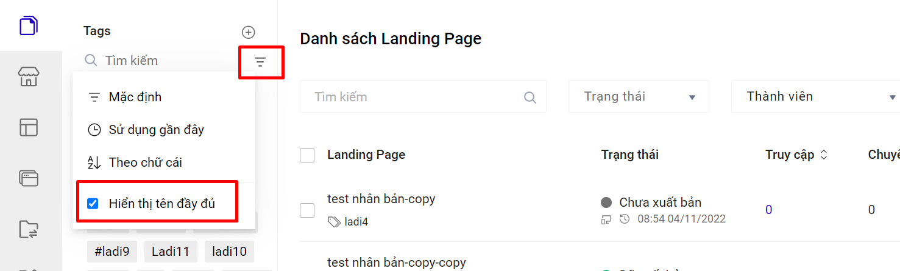

# 9. Tạo Tag và Gắn Tag cho Landing Page

Nếu như trước đây chúng ta vẫn quen với việc sắp xếp tài liệu theo thư mục thì ở LadiPage bạn có thể quản lý các nhóm Landing Page bằng Tag. Các Landing Page thuộc cùng một nhóm sẽ được gắn Tag giống nhau. Một Landing Page có thể thuộc nhiều Tag.&#x20;

**Bước 1: Tạo tag.**

Cách 1: Truy cập mục Landing Page -> Quản lý Tags&#x20;



Bấm vào mục Tạo mới Tag và chọn loại Tag tương ứng&#x20;





Cách 2: Bấm vào mục danh sách Tag, bấm nút Tạo Tag&#x20;



**Bước 2: Gắn và sử dụng tag.**

Quay lại landing page cần chỉnh sửa và gắn Tag, chọn Tag cho landing page.



**Bước 3: Quản lý Tag.**

Bạn click vào từng tên Tag để có thể xem được danh sách các landing page đang được gắn Tag đó.



## Cách quản lý tag landing page hiệu quản.

1. **Pin Tag:** Với Tag được pin sẽ luôn ở vị trí đầu tiên của danh sách Tag. Số lượng tag được pin không giới hạn và Tag nào được pin sau sẽ được hiển thị lên đầu của danh sách. Hiển thị của Tag được pin như sau:







**2. Sắp xếp Tag theo bộ lọc:**

**Bạn có thể sắp xếp Tag theo bộ lọc:**&#x20;



* **Mặc định:** Chế độ Mặc định của Tag sẽ hiển thị theo thứ tự: Tag được pin sau đó là Tag được tạo mới nhất. Nếu bạn không theo kiểu sắp xếp nào thì LadiPage sẽ để ở chế độ Mặc định.
* **Sử dụng gần đây**: Chế độ này sẽ hiển thị theo tag bạn gắn cho landing page gần nhất hoặc tag được gắn cho landing page được xuất bản gần nhất.
* **Theo chữ cái:** Bạn có thể sắp xếp theo từ A -> Z và từ Z -> A.&#x20;

Thứ tự ưu tiên khi sắp xếp từ A --> Z như sau: Ký tự (#, !, \*...) --> Chữ cái in hoa --> Chữ cái thường.&#x20;

* **Hiển thị tên đầy đủ:** Mỗi tag ở chế độ mặc định sẽ hiển thị tối đa theo 1 dòng, tuy nhiên nếu tag của bạn quá dài và bạn muốn hiển thị đầy đủ các ký tự của tag, bạn có thể bật chế độ Hiển thị tên đầy đủ như sau:

<figure><figcaption></figcaption></figure>

Tag ở chế độ hiển thị đầy đủ:



Tag ở chế độ hiện thị không  đầy đủ:




**Lưu ý:**

* Tag đã xóa thì không khôi phục lại được Tag đó.
* Sau khi xóa Tag, các landing page thuộc Tag đã xóa sẽ không bị xóa mà nằm ngoài danh sách Landing page.
* Đối với tài khoản phân quyền, thành viên nhìn thấy tag gồm thành viên tạo tag và được phân quyền tag đó cho thành viên. Chi tiết bảng phân quyền xem [tại đây](https://docs.google.com/spreadsheets/d/18CMe3T_FDa2ioNVpCmidFS303fx7EZUm-ZwZJd1WQ1w/edit#gid=830624375).&#x20;

